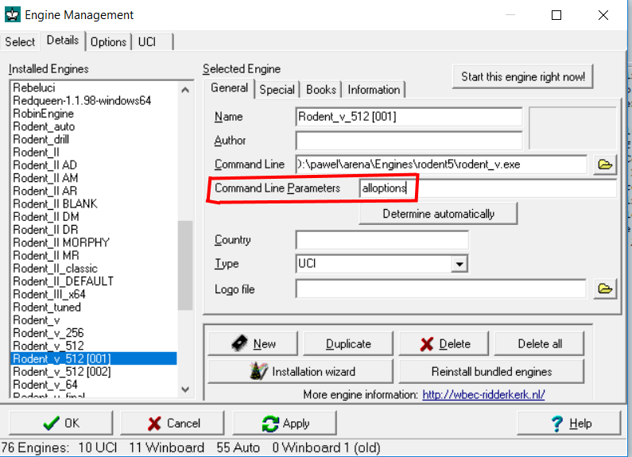
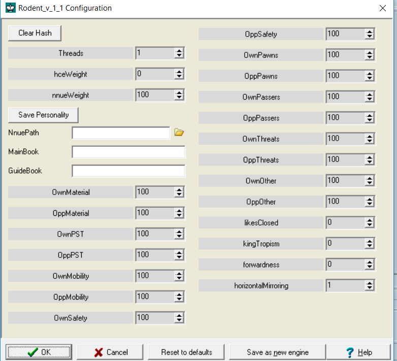

### Rodent manual

## No options mode for testers

Thanks to extensive options system, Rodent V allows to personalize
user's experience. This includes the possibility to *opt out* from 
options system completely. You can do it by calling Rodent V with
a parameter:

rodent_v nooptions

If you use Rodent in the console mode, type it directly. If you use
it within a GUI, make sure to append "nooptions" to the engine
path.

Rodent V in nooptions mode allows to set hash size, number of
threads, Uci_Elo and nothing more. It also informs user whether NNUE
(neural network) has been loaded. It is the safest mode, designed
to protect engine from any interferences, intentional or otherwise.

## All options mode for tweakers

If you want to tweak Rodent's parameters, run it with the command

rodent_v alloptions

Again: type it directly in the console mode, append to the engine 
path calling it from the GUI or use whatever method GUI has to offer
instead. 

  

This exposes everything that Rodent V has to offer. You can tweak 
the options to your liking using whatever controls GUI has to offer, 
and then click the button and save personality.txt in the folder 
where the engine is located. Just note there are no safeguards 
against overwriting!

  

## Default mode

In default mode, Rodent V allows to pick various predefined personalities
by locating and opening personality files. They contain a set of UCI
commands needed to configure a personality, looking very much like:

setoption name [SomeOption] value [for example 100]

They achieve exactly the same as settings available in alloptions mode,
offering tried and tested setups that we consider somewhat interesting.
In other words, they can make Rodent play like, for example, Mikhail Tal,
without figuring out how to achieve this style.

## Folder structure

Default mode relies on the folder structure. Personalities need access
to opening books and neural networks, and if they are to be transferred
from one computer to another, they need repeatable paths. For that
reason they assume that there are three specific subfolders in Rodent
folder: "personalities", "books" and "nets"

## Playing strength

Because Rodent implements UCI_Elo, personality files do not determine
strength. We thought it is fun to be able to play against a weaker
version of Tal.

## Neural networks

Currently Rodent V is able to use two kinds of neural networks. Both
of them have 512 hidden neurons, but one type can use horizontal
mirrorring, and the other cannot. Technically, horizontal mirrorring
allows the network to transfer the patterns it has learned on the 
kingside to the queenside (or another way round). Practically, it
means that that you cannot mix up both types of networks at risk 
of debilitating the engine. 

Because Rodent has no autodetection system, it relies on correct 
setting of horizontalMirroring option. For that reason, it is 
discouraged to rename networks, or change horizontalMirroring setting 
for an existing network.

Rodent's networks are trained using excellent bullet trainer
(https://github.com/jw1912/bullet) and it is the responsibility
of the person who trained them to enforce correct value of 
horizontalMirroring option.

## Eval philosophy

Rodent's personalities are based on an unusual idea that you can
run both neural network and traditional handcrafted eval (HCE)
at the same time. This does not help playing strength (even though
it does not hurt as much as the loss of speed indicates), but creates
additional possibilities for creating distinct personalities.

Personality can be created solely by tweaking HCE parameters,
without NNUE or with its small contribution to overall score.
Or it can be based entirely on a custom made neural network.

These personality networks are made primarily for fun, so test
them only if you are aware that this is not the strongest personality.
of course, happy incidents happen (for Rodent 1.1 it was Anand net,
winning over default with a huge margin) 

## Options

This section is for users who attempt to tune Rodent.

# Side-independent options

nnuePath - path to selected neural network. If no network is found,
Rodent will default to HCE, which will make it weaker or unusable,
depending on other personality settings.

mainBookPath/mainBook - path to engine's main opening book. Books
are in Polyglot format, because open source.

guideBookPath/guideBook - path to engine's guide book, typically
smaller, designed to direct opening play rather than churn out
long lines.

hceWeight - contribution of HCE eval to total score. All other
eval options except of nnueWeight will be scaled by that coefficient.

nnueWeight - contribution of NNUE eval to total score.

nnueScale - used to regulate internal scaling of a neural network;
thanks to it, impact of nnueWeight on each net will be roughly 
the same. Please do not change, unless you change the network.

likesClosed, kingTropism, forwardness - see chapter about Flairs 

horizontalMirroring - se chapter about neural networks (and change
only together with the network)

# Side-dependent options

It is much more interesting if evaluation is asymmetric, and
program can care for some property of its position, ignoring
the same property of opponent's position. That's why some
options are made asymmetric. "Own" options refer to the engine's 
side, "Opp" options to its opponent.

OwnMaterial, OppMaterial 

Weight of piece values. Should be decreased if a personality is 
meant to sacrifice material. Should be kept close to each other, 
because material is by far the dominant contribution to HCE. 
If engine is using NNUE, and nnueWeight is at 30% or above, 
more adventurous personalities can play decent chess with material 
set to 0 (see chaotic.txt)

OwnPst, OppPst 

Contribution of piece/square tables to the eval. Generally both 
values should be kept the same. Decrease for more chaotic style.

OwnMobility, OppMobility 

This is where the fun begins. Mobility reflects how many moves can 
a piece make, and generally minor pieces' contribution is greater. 
This setting yields interesting results if it is asymmetric.

OwnKingSafety, OppKingSafety

OwnKingSafety means: how safe is engine's king, and should
be raised for defence-oriented personalities; OppKingSafety means:
how safe is opponent's king, and should be raised for attacking
personalities. This is opposite of what previous versions of Rodent
did. Again, asymmetry is nice for the personalities.

OwnPawns, OppPawns

Importance of pawn structure, excluding passed pawns. Increase
for positional personalities, decrease for chaotic ones.

OwnPassers, OppPassers

Importance of passed pawns.

OwnThreats, OppThreats

Attacks on enemy pieces. Lower symmetrically for positional 
personalities, raise asymmetrically for attacking ones.

OwnOther, OppOther

Other aspects of evaluation. Generally keep them at 100 or 0.

## Flairs 

Flairs are the aspects which didn't make it into standard evaluation
function - either because we couldn't make it work or because they
were added purely for fun factor. They are separate from main
evaluation function - which should not be of any concern to user, 
but helps to keep code a bit cleaner.

It is recommended to use at most one flair per personality.

The list of flairs is likely to be expanded in future versions of Rodent.

likesClosed - positive values make Rodent prefer closed positions,
with negative values it prefers open positions.

kingTropism - high values means pieces are attracted to the opponent's
king. Creating a personality, you can try negative values for fun,
then the engine would dislike moving towards opponent's king;
bonus points, if you pair it with high king attack.

forwardness - high values mean enhine wants to plant pieces
on the opponent's half of the board.