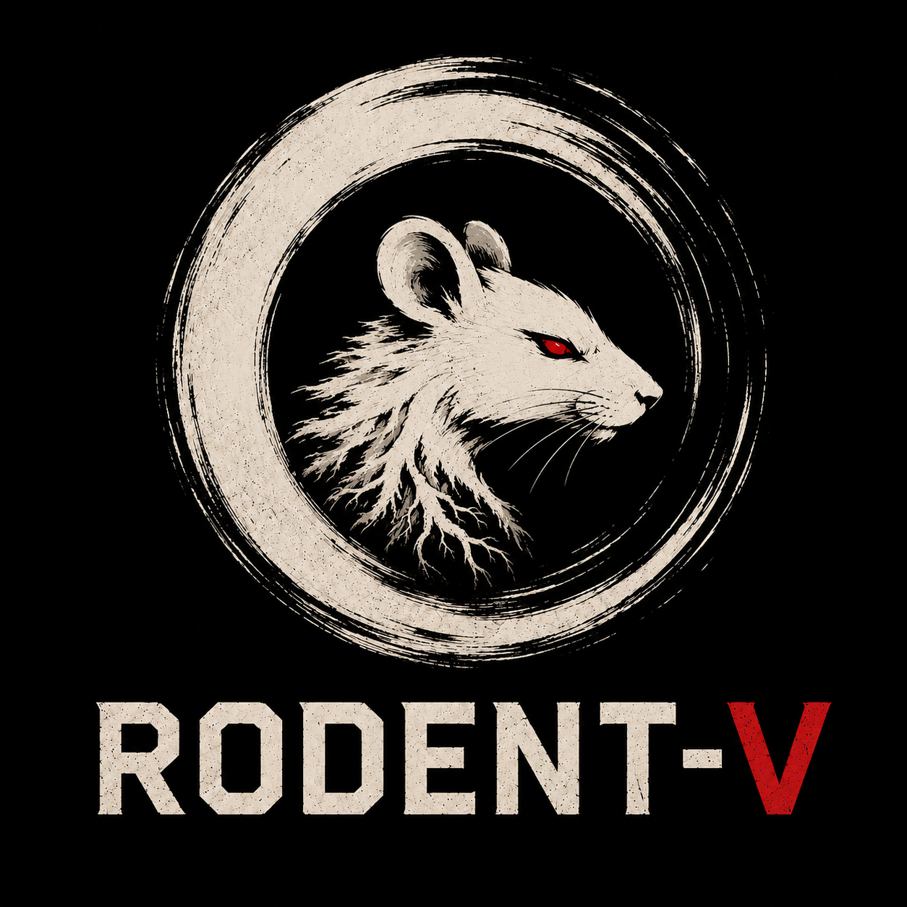

# Rodent V

<p align="center">
  
</p>

A UCI chess engine written in Go by **Naman Thanki** and **Pawel Koziol**.

Based on **Sungorus 1.4** by Pablo Vazquez.

---

Rodent is back! Rewritten in go, supplied with NNUE and developed by two
programmers, ready both to give endless fun with personalities and to contend
for the title of the strongest chess engine written in go.

---

## Gameplay

<table>
  <tr>
    <td align="center">
      
      <br />
      <em>Rodent-V 1.0 vs Stash 35 1-0</em>
    </td>
    <td align="center">
      
      <br />
      <em>Rodent-V Anand vs Chal 1.4.1 1-0</em>
    </td>
    <td align="center">
      
      <br />
      <em>Rodent-V Anand vs Rodent-V Nakamura 0-1</em>
    </td>
  </tr>
  <tr>
    <td align="center">
      
      <br />
      <em>Rodent-V Anand vs Stash 35 1-0</em>
    </td>
    <td align="center">
      
      <br />
      <em>Rodent-V Nakamura vs Fruit 2.1 1-0</em>
    </td>
    <td align="center">
      
      <br />
      <em>Rodent-V Tal vs Fruit 2.1 1-0</em>
    </td>
  </tr>
</table>

---

## Features

- Rodent can use NNUE, handcrafted eval (HCE) or their weighted average
- Default NNUE is bullet-trained 768->(512*2)->1 with horizontal mirroring
- NNUE uses AVX2 instructions if available
- HCE basis: material, piece/square tables, mobility, king safety, passers,
  pawn structure, drawish endgames, interpolated game phase
- HCE quirks: threat eval, additional pst tables based on central pawns position 
- Rodent has a tuner for HCE and datagen for NNUE training
- Evaluation is configurable via personality files
- Search uses iterative deepening with Principal Variation Search (PVS)
- Quiescence search with Static Exchange Evaluation (SEE) and check evasions
- 4-bucket transposition table with aging
- Node-level pruning: reverse futility pruning, razoring, null move
- Move-level selectivity: late move reduction, late move pruning, futility pruning
- Extensions: singular extension and check extension, stacked
- Quiet move ordering: killer heuristic, history, including 2-level continuation history
- Correction history
- Board update is make/unmake, NNUE update is copy-make

## Missing stuff

- outposts in HCE (never worked)
- history pruning (never worked)
- generating checks in early quiescence search (failed)
- null move verification (disabled)
- SEE pruning (TODO)
- UCI elo (you can fiddle with node limit instead)

---

## Build

```
go build -o rodent-v .
```

Requires **Go 1.21 or newer**.
Requires golang.org/x/sys v0.47.0

---

## Run

Works with any **UCI GUI** (Arena, CuteChess, Banksia, etc.) or directly:

```
./rodent-v
uci
isready
position startpos
go depth 12
```

---

## UCI Options

| Name       | Default | Description           |
|------------|---------|-----------------------|
| Threads   | 1		| Number of threads |
| Hash       | 16      | Hash table size in MB |
| Clear Hash | —       | Clears the hash table |
| PersonalityFile | personalities/rodent.txt | Sets playing style |

---

## Debug Commands

| Command     | Description                             |
|-------------|-----------------------------------------|
| `perft <n>` | Count leaf nodes at depth n             |
| `bench <n>`| Runs a benchmark at depth n	|
| `print`     | Print the current board to the terminal |

---

## Perft

```
position startpos
perft 5
```

Expected:

```
Nodes: 4865609
```

---

## Files

| File          | Section | Description                                        |
|---------------|---------|----------------------------------------------------|
| `tables.go`   | S1      | Constants, bit helpers, precomputed attack tables  |
| `pos.go`      | S2      | Board representation and FEN parsing               |
| `attacks.go`  | S3      | Attack detection                                   |
| `moves.go`    | S4      | Make / unmake move                                 |
| `gen.go`      | S5      | Move generation                                    |
| `legal.go`    | S6      | Move legality validation                           |
| `eval.go`     | S7      | Static evaluation (material, PST, mobility, pawns) |
| `endgame.go`	| —       | endgame eval adjustements			|
| `evalhash.go`	| —       | eval and pawn hashes for HCE eval				|
| `evaldata.go`	| —       | "scratchpad" for HCE eval			|
| `eval_flair.go`	| —       | stylistic adjustements for eval			|
| `params.go`	| —       | Eval params exposed to the user				|
| `pesto.go`	| —       | PeSTo eval, if you want to make Rodent dumb				|
| `next.go`     | S8      | Move ordering (TT → good caps → killers → quiet)   |
| `trans.go`    | S9      | Transposition table (4-bucket hash with aging)     |
| `swap.go`     | S10     | Static Exchange Evaluation (SEE)                   |
| `search.go`   | S11     | Principal Variation Search + quiescence            |
| `corrhist.go`	| —       | eval correction by search result			|
| `thread.go`	| —       | Search stack				|
| `uci.go`      | S12     | UCI protocol, time management, perft               |
| `bitboard.go` | —       | Bitboard shift helpers                             |
| `main.go`     | —       | Entry point                                        |
| `nnue.go`	| —       | NNUE eval entry point 							|
| `nnue_scalar.go`	| —       | go helpers for NNUE eval						|
| `nnue_avx2_amd64.go`	| —       | asm helpers' headers				|
| `nnue_avx2_amd64.go`	| —       | asm helpers for NNUE eval			|
| `book.go`	| —       | Polyglot book handling			|
| `bench.go`	| —       | benchmark				|

---


## Credits

- **Sungorus 1.4** — Pablo Vazquez (original C engine)
- **Rodent V** — Naman Thanki and Pawel Koziol
- **JohnathanHallstorm (chef)** ([@JonathanHallstrom](https://github.com/JonathanHallstrom)) — For earlier parts of datagenning of Rodent-V to speed up development.
- **Joshua Shriver** ([@jshriver](https://github.com/jshriver)) — For earlier parts of datagenning of Rodent-V to speed up development.
